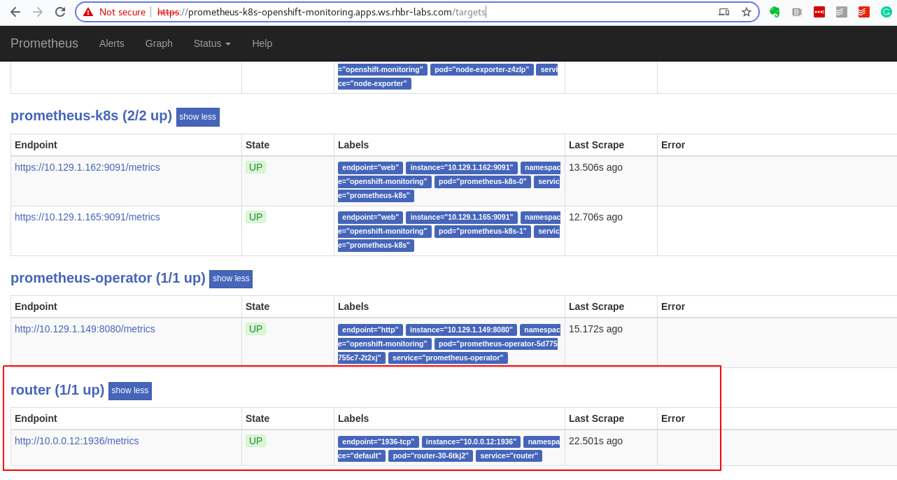

# CREATE HAPROXY DASHBOARD ON OPENSHIFT-MONITORING

## Enable router metrics endpoint

```
oc project default
oc set env dc/router STATS_USERNAME=admin STATS_PASSWORD=password ROUTER_METRICS_TYPE=haproxy -n default
```

## Execute the following command to test haproxy metrics
```
oc -n default exec $(oc get pods -lrouter=router --no-headers | head -1 | awk '{print $1}') -- curl --silent -u admin:password localhost:1936/metrics
```

## Label default namespace to be monitored by prometheus
```
oc label namespace default openshift.io/cluster-monitoring=true
```

## Set metadata and label router service
```
oc patch service router -p '{ "metadata": { "annotations": { "prometheus.io/port": "1936", "prometheus.io/scrape": "true", "prometheus.openshift.io/username": "admin", "prometheus.openshift.io/password": "password" } } }'
oc label service router metrics=router
```

## Create secret for servicemonitor
```
oc project openshift-monitoring

USER_B64=$(echo -n "admin" | base64)
PASSWD_B64=$(echo -n "password" | base64)
cat <<EOF > servicemonitor-auth-secret.yml
  apiVersion: v1
  data:
    username: $USER_B64
    password: $PASSWD_B64
  kind: Secret
  metadata:
    name: servicemonitor-auth
  type: Opaque
EOF
oc apply -f servicemonitor-auth-secret.yml
```

## Create ServiceMonitor
```
cat <<EOF > router-service-monitor.yml
apiVersion: monitoring.coreos.com/v1
kind: ServiceMonitor
metadata:
  labels:
    team: frontend
    k8s-app: router
  name: router-monitor
spec:
  endpoints:
  - basicAuth:
      password:
        key: password
        name: servicemonitor-auth
      username:
        key: username
        name: servicemonitor-auth
    port: 1936-tcp
  namespaceSelector:
    matchNames:
    - default
  selector:
    matchLabels:
      metrics: router
EOF
oc create -f router-service-monitor.yml
```

## Check if router target has been created

Get targets url:
```
echo "https://$(oc get route prometheus-k8s -n openshift-monitoring --no-headers | awk '{print $2}')/targets"
```

Access the page and wait until a router target appears (this can take up to 5 minutes):



## Create dashboard on Grafana

Import one of the following dashboards to Grafana:

- [HAProxy dashboard 1](haproxy-servers-dashboard.json) (Source: https://grafana.com/grafana/dashboards/367)
- [HAProxy dashboard 2](haproxy-servers-dashboard-2.json) (Source: https://raw.githubusercontent.com/rfrail3/grafana-dashboards/master/prometheus/haproxy-full.json)

